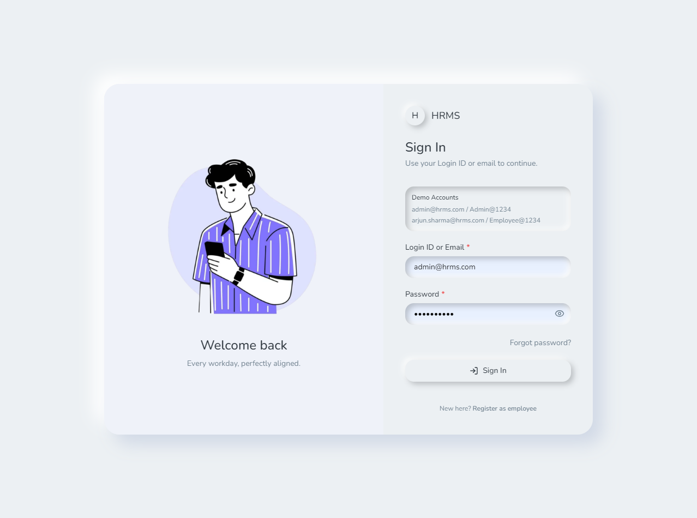
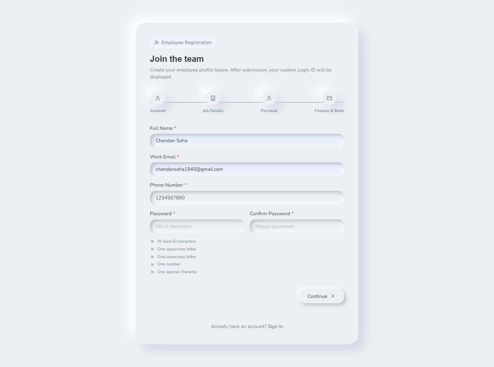

# HRMS (Human Resource Management System) 🚀

A comprehensive, modern, and robust Human Resource Management System built to streamline employee data, attendance tracking, leave requests, and payroll processes. This system provides an intuitive interface with Role-Based Access Control for both Admins and Employees.

## ✨ Key Features

- **Authentication & Security**: Secure JWT-based login system with role-based routing (Admin vs. Employee dashboards).
- **Employee Directory & Profiles**: Detailed employee profiles storing personal information, banking details, skills, certifications, and emergency contacts.
- **Attendance Tracking**: Daily check-in and check-out system to track work hours, breaks, and extra hours.
- **Leave Management**: Apply for leaves, manage leave balances, and allow Admins to approve/reject requests.
- **Payroll System**: Automated tracking and management of employee payroll, basic salary, allowances, and deductions.

## 🛠️ Tech Stack

**Frontend**: React 19, Vite, Tailwind CSS, React Router v6, React Hook Form, Zod, TanStack React Query, Lucide React.
**Backend**: Node.js, Express.js, Prisma ORM, PostgreSQL (with SQLite support), JSON Web Tokens (JWT), Bcrypt.js.

---

## 📸 Screenshots & Previews

### Authentication
**Sign In & Registration**
Access the platform securely.



### 👑 Admin Dashboards
**Admin Overview & Dashboard**
Get a birds-eye view of your organization's key metrics.


**Employee Management**
Manage the employee directory and organizational structure.


**Attendance Tracking (Admin)**
Monitor organization-wide daily attendance.


**Leave Requests Management**
Review, approve, or reject employee leave requests.


**Payroll Management**
Calculate and manage employee payroll effortlessly.


**Admin Profile**
Manage administrative settings and personal details.


### 👤 Employee Dashboards
**Employee Dashboard**
Personalized dashboard for every employee to view their quick stats.


**Attendance (Employee)**
Easy check-in, check-out, and break tracking for employees.


**Leave Application**
Employees can easily apply for leaves and check their leave balance.


**Employee Profile**
Employees can view and update their personal profiles, skills, and certifications.


---

## 🏃‍♂️ Quick Start & Setup Instructions

### 1. Clone the repository
```bash
git clone https://github.com/SnehashisDas024/OdooHackathon.git
cd OdooHackathon
```

### 2. Setup the Database & Backend
```bash
cd server
npm install

# Setup your .env with DATABASE_URL
# Push schema and seed demo accounts
npx prisma db push
npm run db:seed

# Start the server
npm run dev
```
*(Backend runs on http://localhost:5000)*

### 3. Start the Frontend
```bash
cd client
npm install
npm run dev
```
*(Frontend runs on http://localhost:3000)*

## 🔑 Demo Accounts (Seeded)

- **Admin Account**: `admin@hrms.com` / `Admin@1234`
- **Employee Account**: `arjun.sharma@hrms.com` / `Employee@1234`
